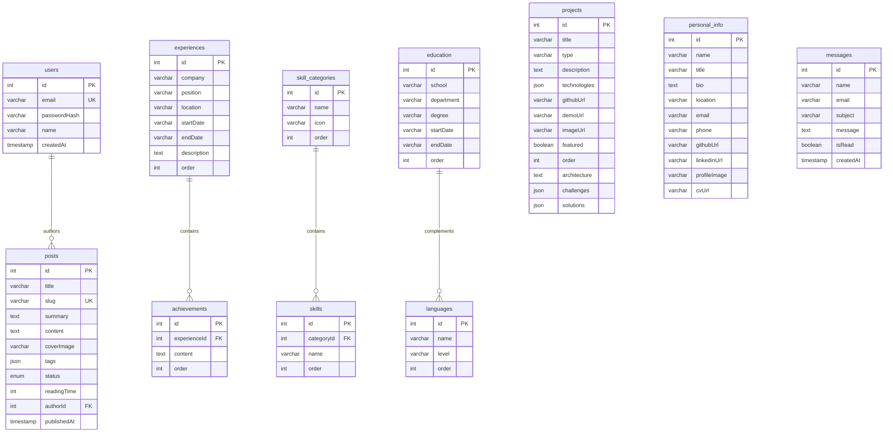

# 🚀 Umut Patlak — Production-Grade Portfolio & Headless CMS Platform

[](https://www.typescriptlang.org/)
[](https://react.dev/)
[](https://nestjs.com/)
[](https://www.postgresql.org/)
[](https://orm.drizzle.team/)
[](https://jestjs.io/)
[](LICENSE)

> A modern, enterprise-grade full-stack personal portfolio, dynamic resume engine, and headless content management system (CMS) engineered with **React 19**, **Vite 6**, **NestJS 11**, **PostgreSQL 16**, and **Drizzle ORM**. Features interactive 3D WebGL geometry morphing, 100% line test coverage, military-grade security hardening, granular rate limiting, multi-language localization, and WCAG AA accessibility.

---

## 📑 Table of Contents

- [✨ Core Features](#-core-features)
  - [🌟 Frontend Experience](#-frontend-experience)
  - [🛡 Backend & Admin CMS](#-backend--admin-cms)
  - [🔒 Security Hardening](#-security-hardening)
  - [⚡ Performance & Code Splitting](#-performance--code-splitting)
  - [🌐 SEO & Accessibility (a11y)](#-seo--accessibility-a11y)
  - [🎨 UX & Micro-Interactions](#-ux--micro-interactions)
- [🛠 Tech Stack](#-tech-stack)
- [🧪 Testing & Quality Assurance](#-testing--quality-assurance)
- [📂 Project Structure](#-project-structure)
- [🗄 Database Schema](#-database-schema)
- [🔌 API Endpoints](#-api-endpoints)
- [⚡ Getting Started](#-getting-started)
  - [Prerequisites](#prerequisites)
  - [1. Clone Repository](#1-clone-repository)
  - [2. Backend Setup (NestJS + PostgreSQL)](#2-backend-setup-nestjs--postgresql)
  - [3. Frontend Setup (React + Vite)](#3-frontend-setup-react--vite)
- [🔐 Admin Panel & Content Management](#-admin-panel--content-management)
- [📜 Available Scripts](#-available-scripts)
- [🛡 Environment Variables](#-environment-variables)
- [🌐 Deployment](#-deployment)
- [📄 License](#-license)

---

## ✨ Core Features

### 🌟 Frontend Experience
- **Interactive 3D Background Engine**: Built with Three.js, featuring an ambient wireframe mesh that morphs across 5 geometric topological forms (Icosahedron ➔ Octahedron ➔ Torus ➔ Cube ➔ Sphere) synchronized with scroll progression, mouse parallax, and real-time dark/light theme color adaptation.
- **Terminal Intro Sequence**: Interactive hacker-themed terminal boot animation with typewriter diagnostics on initial load (persisted via `sessionStorage`).
- **Dynamic Resume & CV Engine**: Complete interactive resume rendering real-time work history, achievements, education, and categorized skills with direct PDF download integration.
- **Projects Showcase & Case Studies**: Filterable project gallery with tags, live demo & source links, and detailed case studies (system architecture, technical challenges, and engineering solutions).
- **GFM Markdown Blog**: Full GitHub Flavored Markdown reader with syntax highlighting (`react-syntax-highlighter`), estimated reading time calculation, tag filtering, and clean responsive typography.
- **Multi-Language Support (i18n)**: Instant English and Turkish localization powered by `react-i18next` with language toggle.
- **GitHub Contribution Stream**: Live GitHub activity widget integrated directly onto the homepage.

### 🛡 Backend & Admin CMS
- **Modular Enterprise Architecture**: NestJS 11 backend organized into cohesive domain modules with strict separation of concerns, dependency injection, and centralized error handling via global exception filters.
- **Full Admin Headless CMS** (7 dedicated management modules):
  - **📝 Blog Posts**: Draft vs. Published states, slug validation, tag taxonomy, reading time computation, and cover image uploads.
  - **💼 Projects**: Comprehensive project management with featured toggles, display ordering, tag chips, and full case study schemas.
  - **🧑‍💼 Experience**: Work history, company, role, date ranges, bulleted achievements, and manual order sorting.
  - **🎯 Skills**: Categorized skill groups with drag-and-drop ordering and individual skill badges.
  - **🎓 Education & Languages**: Degree records, universities, departments, and CEFR language proficiency levels.
  - **👤 Personal Profile**: Biographical info, location, contact details, social URLs, profile image upload, and CV file upload.
  - **📬 Contact Inbox**: Direct message reader with read/unread flags, toggle states, and message deletion.
- **Robust File Upload Pipeline**: Multi-part upload handler (`multer`) with strict MIME-type sniffing (JPEG, PNG, WebP, GIF for images; PDF for documents), size limits (5MB for images, 15MB for documents), and randomized UUID filenames.
- **Infrastructure & Observability**: Real-time `/health` check verifying live PostgreSQL database connectivity, and automated dynamic `/sitemap.xml` generation for search indexing.

### 🔒 Security Hardening
- **Helmet HTTP Headers**: Global HTTP security headers including DNS prefetch control, frameguard (clickjacking prevention), hidePoweredBy, HSTS, and XSS protection.
- **Granular Rate Limiting**: Multi-tiered protection powered by `@nestjs/throttler`:
  - **Admin Login**: 5 attempts per 5 minutes (`limit: 5, ttl: 300000`) preventing brute-force attacks.
  - **Contact Submissions**: 3 messages per minute (`limit: 3, ttl: 60000`) preventing form spam.
  - **Global API**: 30 requests per minute baseline throttling.
- **Strict JWT Secret Enforcement**: Fails-fast at server startup if `JWT_SECRET` is missing (`config.getOrThrow<string>('JWT_SECRET')`).
- **CORS Whitelist & Subdomain Regex**: Dynamically validates origins against explicit whitelists and safe regex patterns (e.g., `*.umutpatlak.com` and Vercel preview environments `*.vercel.app`).
- **Payload Validation**: Strict `ValidationPipe` with `whitelist: true` and `forbidNonWhitelisted: true` to prevent mass-assignment vulnerabilities.

### ⚡ Performance & Code Splitting
- **Route-Level Code Splitting**: All pages lazy-loaded via `React.lazy()` and wrapped in `Suspense` with custom fallback loaders.
- **Three.js Lazy Loading**: Heavy 3D WebGL canvas is asynchronously loaded only after critical DOM is mounted, eliminating render blocking.
- **Smart Vendor Chunking (Vite)**: Manual chunking strategy isolates `vendor-react`, `vendor-three`, `vendor-framer`, `vendor-icons`, and `vendor-syntax` into cached standalone bundles.
- **Optimized Animation Loop**: `requestAnimationFrame` animation loop pauses automatically when the browser tab is hidden (`visibilitychange`), saving CPU/GPU resources and device battery.
- **TanStack React Query Caching**: Server state caching with 5-minute stale times minimizing unnecessary backend roundtrips.

### 🌐 SEO & Accessibility (a11y)
- **Dynamic Sitemap**: Server-side `/sitemap.xml` dynamically aggregates all static routes and published blog posts with update timestamps.
- **Meta & Open Graph Tags**: Contextual social preview cards (OG title, description, image) managed via `react-helmet-async`.
- **Search Engine Discovery**: Comprehensive `robots.txt` pointing crawlers directly to the live sitemap.
- **WCAG AA Compliance**: High-contrast typography across both light and dark themes meeting accessibility contrast thresholds.
- **Keyboard Navigation**: Distinct `:focus-visible` styling on all interactive links, buttons, and form controls.
- **Semantic HTML & ARIA**: Landmark regions (`<main>`, `<nav>`, `<footer>`), descriptive ARIA labels, and hidden utility states (`aria-hidden="true"` on 3D canvas).

### 🎨 UX & Micro-Interactions
- **Toast Notifications**: Lightweight, accessible toast alerts powered by `react-hot-toast` for all async actions (login, updates, message sends).
- **Destructive Action Protection**: Reusable `ConfirmDialog` modal preventing accidental deletions in the Admin CMS.
- **Loading Skeletons**: Tailored animated skeleton states (`SkeletonCard`, `SkeletonSection`) ensuring zero layout shift during content fetch.
- **Resilient Error Handling**: Global `ErrorBoundary` catching unexpected rendering failures with an intuitive reset interface.
- **Custom 404 Experience**: Branded, interactive "Not Found" page with easy one-click return to home.

---

## 🛠 Tech Stack

### Frontend
| Technology | Version | Purpose |
| :--- | :--- | :--- |
| **React** | `^19.0.0` | Declarative component UI library with lazy loading & Suspense |
| **TypeScript** | `~5.7.0` | End-to-end type safety across components, hooks, and services |
| **Vite** | `^6.0.0` | Lightning-fast development tooling with manual vendor chunking |
| **Tailwind CSS** | `^4.0.0` | Modern utility-first CSS styling via `@tailwindcss/vite` |
| **Three.js** | `^0.185.1` | WebGL 3D wireframe mesh & scroll-driven morphing geometry |
| **Framer Motion** | `^11.15.0` | Declarative page transitions and layout micro-animations |
| **TanStack React Query** | `^5.62.0` | Server state management, smart background caching & refetching |
| **React Router** | `^7.1.0` | Client-side routing with route-based code splitting |
| **react-hot-toast** | `^2.5.1` | Sleek, customizable notification toast system |
| **react-i18next** | `^17.0.12` | Multi-language localization (Turkish & English) |
| **react-helmet-async** | `^2.0.5` | Head meta tag, Open Graph, and Twitter card management |
| **Lucide React** | `^0.468.0` | Clean, modern iconography |
| **React Markdown / GFM** | `^9.0.1` | Markdown rendering with table, strikethrough, and task list support |
| **React Syntax Highlighter** | `^15.6.1` | Code snippet syntax highlighting for technical articles |
| **Axios** | `^1.7.9` | Promise-based HTTP client with interceptors |

### Backend
| Technology | Version | Purpose |
| :--- | :--- | :--- |
| **NestJS** | `^11.0.0` | Progressive enterprise Node.js framework |
| **TypeScript** | `^5.7.0` | Strongly typed backend logic and strict DTO compilation |
| **PostgreSQL** | `16-alpine` | Robust relational database deployed via Docker |
| **Drizzle ORM** | `^0.38.0` | Lightweight, high-performance TypeScript ORM |
| **Drizzle Kit** | `^0.31.10` | Database schema migrations and Drizzle Studio GUI |
| **Passport & JWT** | `^11.0.0` | Stateless token-based authentication with Passport strategy |
| **Bcrypt** | `^5.1.1` | Secure one-way salt hashing for passwords |
| **Helmet** | `^8.3.0` | Security middleware configuring 15+ HTTP response headers |
| **@nestjs/throttler** | `^6.0.0` | Granular rate limiting for auth, contact, and global endpoints |
| **Class Validator / Transformer** | `^0.14.1` | Decorator-based input validation and DTO sanitization |
| **Multer** | `Express` | In-memory file upload processing with MIME & size validation |
| **Jest & ts-jest** | `^30.5.1` | Comprehensive unit test suite with 100% line coverage |

---

## 🧪 Testing & Quality Assurance

The backend includes a comprehensive, battle-tested test suite built with **Jest** and **ts-jest**. All business logic services, security guards, strategies, and infrastructure providers are thoroughly tested with mock database layers, error conditions, and edge cases.

### Test Metrics
- **Total Tests**: 135 unit tests (100% passing)
- **Test Suites**: 12 total test suites
- **Line Coverage**: **100%** (372 / 372 lines)
- **Statement Coverage**: **100%** (409 / 409 statements)
- **Function Coverage**: **100%** (81 / 81 functions)
- **Branch Coverage**: **99.53%** (214 / 215 branches)

### Coverage Breakdown
| Module / Service | Statements | Branches | Functions | Lines | Status |
| :--- | :--- | :--- | :--- | :--- | :--- |
| `auth.service` & `jwt.strategy` | 100% | 100% | 100% | 100% | ✅ Passed |
| `blog.service` | 100% | 100% | 100% | 100% | ✅ Passed |
| `projects.service` | 100% | 100% | 100% | 100% | ✅ Passed |
| `experiences.service` | 100% | 100% | 100% | 100% | ✅ Passed |
| `skills.service` | 100% | 100% | 100% | 100% | ✅ Passed |
| `education.service` | 100% | 100% | 100% | 100% | ✅ Passed |
| `personal-info.service` | 100% | 100% | 100% | 100% | ✅ Passed |
| `contact.service` | 100% | 100% | 100% | 100% | ✅ Passed |
| `upload.service` | 100% | 94.11% | 100% | 100% | ✅ Passed |
| `health.service` | 100% | 100% | 100% | 100% | ✅ Passed |
| `sitemap.service` | 100% | 100% | 100% | 100% | ✅ Passed |

### Running Tests

```bash
# Navigate to the backend directory
cd server

# Run all unit tests
npm run test

# Run tests in watch mode for active development
npm run test:watch

# Run tests with detailed code coverage table
npm run test:cov
```

---

## 📂 Project Structure

```bash
personal-portfolio-blog/
├── client/                          # Frontend Application (React 19 + Vite 6)
│   ├── public/                      # Static assets, icons, robots.txt, sitemap.xml
│   ├── src/
│   │   ├── components/
│   │   │   ├── admin/               # Admin CMS tabs (Blog, Projects, Experience,
│   │   │   │                          Skills, Education, Profile, Inbox, ProtectedRoute)
│   │   │   ├── blog/                # BlogCard, reading time indicator
│   │   │   ├── home/                # Hero, About, Skills, Experience, Education,
│   │   │   │                          Projects, Contact, GitHubActivity
│   │   │   ├── layout/              # Navbar, Footer, Layout (with lazy 3D background)
│   │   │   ├── seo/                 # SEO head manager (react-helmet-async)
│   │   │   └── ui/                  # Background3D (Three.js), IntroAnimation (Terminal),
│   │   │                              ErrorBoundary, ConfirmDialog, SkeletonCard,
│   │   │                              SkeletonSection, ThemeToggle, LanguageToggle, Button
│   │   ├── data/                    # Static fallback data (blog-data.ts, cv-data.ts)
│   │   ├── hooks/                   # useAuth, useTheme, useScrollAnimation
│   │   ├── i18n/                    # i18next configuration and translations (en.json, tr.json)
│   │   ├── lib/                     # Utility helpers (utils.ts)
│   │   ├── pages/                   # Lazy-loaded pages:
│   │   │                              HomePage, ResumePage, BlogPage, BlogPostPage,
│   │   │                              ProjectDetailPage, AdminLoginPage,
│   │   │                              AdminDashboardPage, AdminPostEditorPage, NotFoundPage
│   │   ├── services/                # Axios API clients: auth, blog, contact, projects,
│   │   │                              experiences, skills, education, personalInfo, upload
│   │   ├── types/                   # Shared TypeScript models and interfaces
│   │   ├── App.tsx                  # App root with router, Suspense, Toaster, ErrorBoundary
│   │   ├── index.css                # Tailwind v4 tokens, design variables & WCAG styles
│   │   └── main.tsx                 # Client entry point
│   ├── index.html
│   ├── package.json
│   ├── tsconfig.json
│   └── vite.config.ts               # Vite configuration with manualChunks vendor splitting
│
├── server/                          # Backend Application (NestJS 11)
│   ├── src/
│   │   ├── auth/                    # JWT authentication, passport strategy, rate-limited login
│   │   ├── blog/                    # Blog post CRUD (drafts, slugs, tags, markdown)
│   │   ├── projects/                # Projects CRUD (case study, ordering, featured flag)
│   │   ├── experiences/             # Work experiences and achievements CRUD with reorder
│   │   ├── skills/                  # Skill categories and skills CRUD with reorder
│   │   ├── education/               # Education history and languages CRUD
│   │   ├── personal-info/           # Personal bio, contact, and social profile management
│   │   ├── contact/                 # Contact form submission (rate-limited) & inbox management
│   │   ├── upload/                  # File upload module (images & documents with validation)
│   │   ├── health/                  # Health check verifying PostgreSQL database connection
│   │   ├── sitemap/                 # Dynamic sitemap.xml generator module
│   │   ├── common/                  # Global exception filters, guards, and decorators
│   │   ├── db/
│   │   │   ├── schema.ts            # Drizzle ORM schema (10 PostgreSQL tables)
│   │   │   ├── database.module.ts   # Database connection pool provider
│   │   │   └── seed.ts              # Database seeding script (admin user & initial content)
│   │   ├── app.module.ts            # Root application module with throttler configuration
│   │   └── main.ts                  # Server entry point: Helmet, CORS whitelist, validation
│   ├── uploads/                     # Statically served uploaded files (/images, /documents)
│   ├── coverage/                    # Jest code coverage reports (HTML & lcov)
│   ├── .env.example                 # Environment variables template
│   ├── drizzle.config.ts            # Drizzle migration and studio configuration
│   ├── jest.config.ts               # Jest test runner configuration
│   ├── package.json
│   └── tsconfig.json
│
├── docker-compose.yml               # PostgreSQL 16-alpine container definition
├── .gitignore                       # Repository ignore rules
└── README.md                        # Documentation
```

---

## 🗄 Database Schema

The database architecture is designed with **PostgreSQL 16** and mapped with **Drizzle ORM** across **10 relational tables**:



---

## 🔌 API Endpoints

All primary application endpoints operate under the `/api` prefix (except `/health` and `/sitemap.xml`).

### 🔐 Authentication
| Method | Endpoint | Auth | Rate Limit | Description |
| :--- | :--- | :---: | :---: | :--- |
| `POST` | `/api/auth/login` | ❌ | **5 req / 5 min** | Authenticate admin credentials and return JWT |
| `GET` | `/api/auth/profile` | ✅ | Global | Retrieve current authenticated user profile |

### 📝 Blog Posts
| Method | Endpoint | Auth | Description |
| :--- | :--- | :---: | :--- |
| `GET` | `/api/blog` | ❌ | List published blog posts (supports search & tag filters) |
| `GET` | `/api/blog/:slug` | ❌ | Get a single published post by unique slug |
| `GET` | `/api/blog/admin/all` | ✅ | List all blog posts including drafts |
| `POST` | `/api/blog` | ✅ | Create a new blog post |
| `PUT` | `/api/blog/:id` | ✅ | Update an existing blog post |
| `DELETE` | `/api/blog/:id` | ✅ | Delete a blog post |

### 💼 Projects
| Method | Endpoint | Auth | Description |
| :--- | :--- | :---: | :--- |
| `GET` | `/api/projects` | ❌ | List all portfolio projects (ordered) |
| `POST` | `/api/projects` | ✅ | Create a new project with case study fields |
| `PUT` | `/api/projects/:id` | ✅ | Update an existing project |
| `DELETE` | `/api/projects/:id` | ✅ | Delete a project |

### 🧑‍💼 Experiences & Achievements
| Method | Endpoint | Auth | Description |
| :--- | :--- | :---: | :--- |
| `GET` | `/api/experiences` | ❌ | List all work experiences with nested achievements |
| `GET` | `/api/experiences/:id` | ❌ | Get a single work experience record |
| `POST` | `/api/experiences` | ✅ | Create a new work experience with achievements |
| `PATCH` | `/api/experiences/reorder` | ✅ | Reorder experiences order positions |
| `PATCH` | `/api/experiences/:id` | ✅ | Update an existing experience record |
| `DELETE` | `/api/experiences/:id` | ✅ | Delete an experience record |

### 🎯 Skills & Categories
| Method | Endpoint | Auth | Description |
| :--- | :--- | :---: | :--- |
| `GET` | `/api/skills` | ❌ | List all skill categories with associated skills |
| `POST` | `/api/skills/categories` | ✅ | Create a new skill category |
| `PATCH` | `/api/skills/categories/reorder` | ✅ | Reorder skill categories |
| `PATCH` | `/api/skills/categories/:id` | ✅ | Update a skill category name or icon |
| `DELETE` | `/api/skills/categories/:id` | ✅ | Delete a skill category |
| `POST` | `/api/skills` | ✅ | Add a new skill under a category |
| `PATCH` | `/api/skills/reorder` | ✅ | Reorder individual skills |
| `PATCH` | `/api/skills/:id` | ✅ | Update a skill name or category assignment |
| `DELETE` | `/api/skills/:id` | ✅ | Delete an individual skill |

### 🎓 Education & Languages
| Method | Endpoint | Auth | Description |
| :--- | :--- | :---: | :--- |
| `GET` | `/api/education` | ❌ | List all education entries and language proficiencies |
| `POST` | `/api/education` | ✅ | Add a new education entry |
| `PATCH` | `/api/education/:id` | ✅ | Update an education record |
| `DELETE` | `/api/education/:id` | ✅ | Delete an education record |
| `POST` | `/api/education/languages` | ✅ | Add a new language proficiency entry |
| `PATCH` | `/api/education/languages/:id` | ✅ | Update language proficiency details |
| `DELETE` | `/api/education/languages/:id` | ✅ | Delete a language entry |

### 👤 Personal Profile
| Method | Endpoint | Auth | Description |
| :--- | :--- | :---: | :--- |
| `GET` | `/api/personal-info` | ❌ | Retrieve public personal profile info |
| `PATCH` | `/api/personal-info` | ✅ | Partially update profile info (name, bio, links, CV, image) |
| `PUT` | `/api/personal-info` | ✅ | Fully update profile info |

### 📬 Contact & Inbox
| Method | Endpoint | Auth | Rate Limit | Description |
| :--- | :--- | :---: | :---: | :--- |
| `POST` | `/api/contact` | ❌ | **3 req / 1 min** | Submit a contact form message |
| `GET` | `/api/contact` | ✅ | Global | Retrieve all inbox submissions |
| `PATCH` | `/api/contact/:id/read` | ✅ | Global | Mark a specific message as read |
| `PATCH` | `/api/contact/:id/unread` | ✅ | Global | Mark a specific message as unread |
| `PATCH` | `/api/contact/:id/toggle-read` | ✅ | Global | Toggle read/unread status |
| `DELETE` | `/api/contact/:id` | ✅ | Global | Delete a message from the inbox |

### 📤 File Uploads
| Method | Endpoint | Auth | Allowed Types | Max Size | Description |
| :--- | :--- | :---: | :---: | :---: | :--- |
| `POST` | `/api/upload/image` | ✅ | JPEG, PNG, WebP, GIF | **5 MB** | Upload avatar or blog cover image |
| `POST` | `/api/upload/document` | ✅ | PDF (`application/pdf`) | **15 MB** | Upload CV / resume document |

### 🔧 Observability & Infrastructure (Root Level)
| Method | Endpoint | Auth | Description |
| :--- | :--- | :---: | :--- |
| `GET` | `/health` | ❌ | Real-time health check (verifies live PostgreSQL connectivity) |
| `GET` | `/sitemap.xml` | ❌ | Auto-generated XML sitemap for search engine crawlers |

---

## ⚡ Getting Started

### Prerequisites
Before running the application, ensure you have the following installed:
- [Node.js](https://nodejs.org/) (v20.x or higher)
- [Docker Desktop](https://www.docker.com/) (Recommended for PostgreSQL containerization)
- [Git](https://git-scm.com/)

---

### 1. Clone Repository

```bash
git clone https://github.com/UmutPatlak/personal-portfolio-blog.git
cd personal-portfolio-blog
```

---

### 2. Backend Setup (NestJS + PostgreSQL)

1. **Spin up PostgreSQL via Docker**:
   ```bash
   docker compose up -d
   ```

2. **Navigate to backend and install dependencies**:
   ```bash
   cd server
   npm install
   ```

3. **Configure Environment Variables**:
   ```bash
   cp .env.example .env
   ```
   *Update `server/.env` with your desired configuration:*
   ```env
   # Database
   DATABASE_HOST=localhost
   DATABASE_PORT=5432
   DATABASE_USER=postgres
   DATABASE_PASSWORD=postgres
   DATABASE_NAME=umut_portfolio

   # Security & Auth
   JWT_SECRET=your-super-secret-jwt-key-change-this-min-32-chars
   JWT_EXPIRATION=7d

   # Admin Seed
   ADMIN_EMAIL=umutpatlak77@gmail.com
   ADMIN_PASSWORD=your_secure_password
   ADMIN_NAME=Umut Patlak
   ```

4. **Push Database Schema & Seed Initial Data**:
   ```bash
   npm run db:push
   npm run seed
   ```

5. **Start Backend in Development Mode**:
   ```bash
   npm run start:dev
   ```
   > 🚀 Server running at: `http://localhost:3000` (API: `http://localhost:3000/api`)

---

### 3. Frontend Setup (React + Vite)

1. **Open a new terminal, navigate to client, and install dependencies**:
   ```bash
   cd client
   npm install
   ```

2. **Start Vite Development Server**:
   ```bash
   npm run dev
   ```
   > 🌐 Client running at: `http://localhost:5173`

---

## 🔐 Admin Panel & Content Management

The platform includes a dedicated, secure Admin CMS for managing all portfolio content in real-time without redeploying code.

- **Admin Login**: Access `/admin/login` on the client application.
- **Credentials**: Uses credentials configured in your `server/.env` file during `npm run seed`.
- **Admin Dashboard**: Located at `/admin/dashboard` (protected via JWT AuthGuard and React `ProtectedRoute`).

### CMS Management Modules:
1. 📝 **Blog Tab**: Full markdown editor, live preview, reading time estimator, slug customization, and cover photo upload.
2. 💼 **Projects Tab**: Case study writer with technical architecture, challenges, solutions, demo URLs, and GitHub links.
3. 🧑‍💼 **Experience Tab**: Company name, role, date ranges, descriptions, and dynamic bulleted achievement lists with reorder support.
4. 🎯 **Skills Tab**: Create skill categories (e.g. Backend, Frontend, Cloud) and manage badges with order adjustment.
5. 🎓 **Education Tab**: Academic degrees, graduation timelines, and language proficiencies (Native, Fluent, Professional).
6. 👤 **Profile Tab**: Edit display name, title, bio, location, email, phone, social handles, profile avatar, and upload PDF CVs.
7. 📬 **Inbox Tab**: Contact submissions monitor with read status toggling, detailed view, and deletion.

---

## 📜 Available Scripts

### Server (`/server`)
| Command | Description |
| :--- | :--- |
| `npm run start:dev` | Launch NestJS in watch mode |
| `npm run dev` | Convenience alias for `start:dev` |
| `npm run build` | Compile production TypeScript bundle |
| `npm run start:prod` | Run compiled production server from `dist/` |
| `npm run test` | Run Jest unit tests (135 tests) |
| `npm run test:watch` | Run Jest tests in interactive watch mode |
| `npm run test:cov` | Run Jest tests with code coverage table |
| `npm run db:push` | Synchronize Drizzle schema directly to PostgreSQL |
| `npm run db:generate` | Generate schema migration files |
| `npm run db:migrate` | Execute pending database migrations |
| `npm run db:studio` | Launch Drizzle Studio Web GUI interface |
| `npm run seed` | Seed database with initial admin credentials & data |

### Client (`/client`)
| Command | Description |
| :--- | :--- |
| `npm run dev` | Start Vite development server with HMR |
| `npm run build` | Run TypeScript type-check and Vite production build |
| `npm run preview` | Locally preview compiled production build |
| `npm run lint` | Run ESLint validation checks |

---

## 🛡 Environment Variables

| Variable | Required | Description | Default / Example |
| :--- | :---: | :--- | :--- |
| `PORT` | ❌ | Backend HTTP port | `3000` |
| `NODE_ENV` | ❌ | Runtime environment | `development` / `production` |
| `DATABASE_HOST` | ✅ | PostgreSQL server host | `localhost` |
| `DATABASE_PORT` | ✅ | PostgreSQL server port | `5432` |
| `DATABASE_USER` | ✅ | Database user | `postgres` |
| `DATABASE_PASSWORD` | ✅ | Database password | `postgres` |
| `DATABASE_NAME` | ✅ | Database name | `umut_portfolio` |
| `DATABASE_SSL` | ❌ | Enable SSL for cloud DBs (Neon/Supabase/Railway) | `false` |
| `JWT_SECRET` | ✅ | **Enforced:** Min 32-char secret for JWT signing | — |
| `JWT_EXPIRATION` | ❌ | JWT token lifetime duration | `7d` |
| `CORS_ORIGINS` | ❌ | Additional allowed origins (comma-separated) | — |
| `FRONTEND_URL` | ❌ | Production frontend URL (for CORS allowance) | `https://umutpatlak.com` |
| `ADMIN_EMAIL` | ✅ | Initial admin email for seeding | `umutpatlak77@gmail.com` |
| `ADMIN_PASSWORD` | ✅ | Initial admin password for seeding | — |
| `ADMIN_NAME` | ❌ | Display name for admin user | `Umut Patlak` |

---

## 🌐 Deployment

- **Backend**: Can be deployed seamlessly to [Railway](https://railway.app/), [Render](https://render.com/), or any container/Node.js cloud platform. Automatically adapts to dynamic `PORT` and connects to managed PostgreSQL with `DATABASE_URL` or discrete parameters.
- **Frontend**: Deployable to [Vercel](https://vercel.com/) or [Cloudflare Pages]. All Vercel preview environments (`*.vercel.app`) and custom subdomains (`*.umutpatlak.com`) are permitted by backend CORS policy.
- **Static Assets & Uploads**: Uploaded images and documents in `/uploads` are served statically. In containerized cloud environments, configure persistent volume mounts or object storage (AWS S3 / Cloudflare R2).

---

## 📄 License

This project is open-source and licensed under the [MIT License](LICENSE).

---

Developed with precision and engineering passion by **[Umut Patlak](https://github.com/UmutPatlak)**
